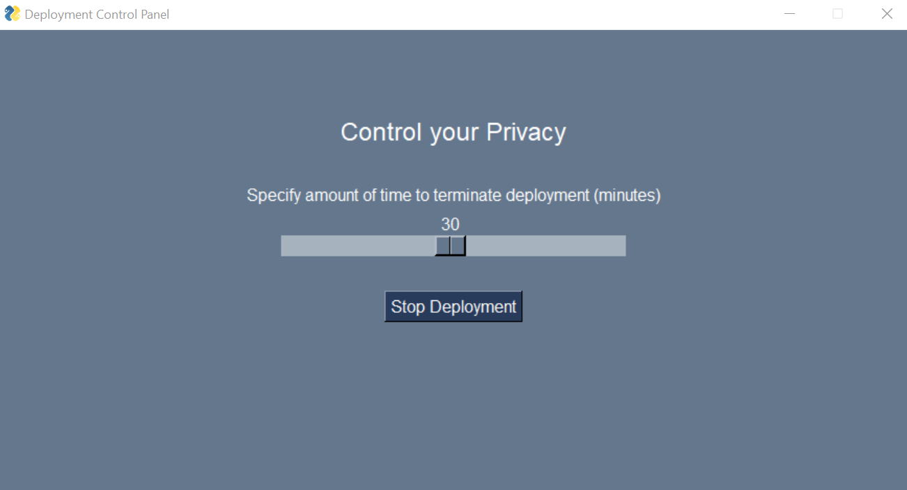

# Deployment Timeout
To help provide users with privacy, this repository gives the user control over terminating a deployment for a specific amount of time. 



## Usage

Install dependencies
```bash
pip install -r requirements.txt
```

Within user_control_window.py add python script names to kill and the batch files to start these scripts
```python

kill_list = ['example_process.py', ...]
batch_files_to_execute = ['C:/Users/Examples/example_process.bat', ...]

```

## Run
Click on **user_control_window.bat**


